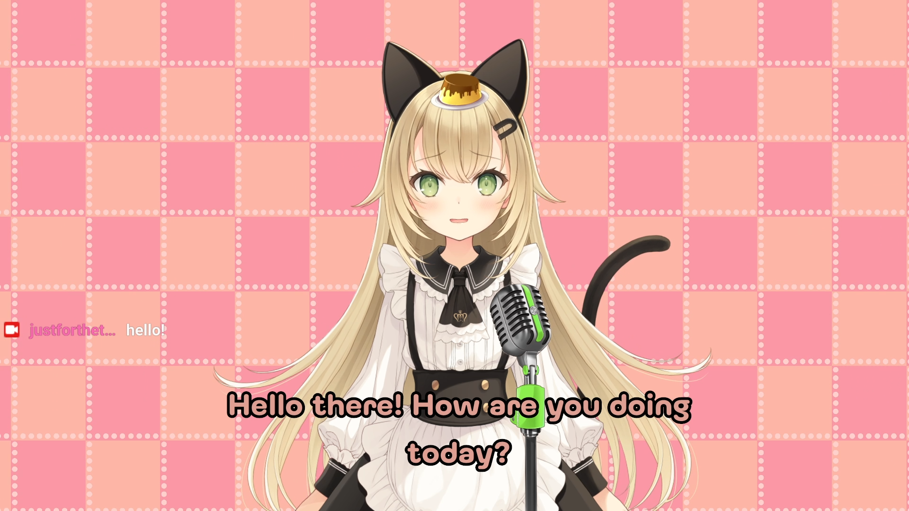

# Waifu_AI_Vtuber

Waifu_AI_Vtuber is a Python-based AI virtual YouTuber chatbot. The chatbot interacts with live YouTube chat, processes the messages, generates responses using the OpenAI GPT-3.5 model, and provides text-to-speech audio output for responses using VoiceVox engine.

## Features

- Real-time interaction with YouTube live chat.
- Utilizes OpenAI GPT-3.5 model for generating chat responses.
- Converts generated responses into Japanese text-to-speech audio.
- Creates subtitle files in any language that can be used in obs.
- Customizable character names and their prompt.

## Prerequisites

- Python 3.6 or higher if you didn't have it download it from [here](https://www.python.org/downloads/)
- Voicevox software Version 0.14.7 or higher if you didn't have it download it from [here](https://voicevox.hiroshiba.jp/), installed and running.

## Installation

1. Clone this repository: `git clone https://github.com/ZeroMirai/Waifu_AI_Vtuber.git`
2. Open cmd or terminal and type `cd` followed by where this folder is located for example `cd C:\my code\Waifu_AI_Vtuber`
3. Install any necessary library: `pip install -r requirements.txt`
4. Configure the necessary API keys and settings in the respective files in api_key_chat.py for chat-GPT API key and youtube_chat.py for an ID for your live).

## File Structure

- **main.py**: Main code for the AI virtual YouTuber chatbot.
- **youtube_chat.py**: Code to read and process YouTube live chat messages.
- **api_key_chat**: API key from OpenAI for chat-GPT for more information about how to get it, follow the comment in the code.
- **chatbot.py**: Code to interact with the OpenAI GPT-3.5 model for chat responses.
- **create_subtitle.py**: Code to generate subtitle files to use in obs.
- **tts.py**: Code for text-to-speech using Voicevox.

## Configuration

- Update **main.py** with the character's name and the directory path where the code is located.
- Configure API keys and settings in the code files as specified in the comments in **api_key_chat.py** to generate chat responses and **youtube_chat.py** to capture a youtube live chat.

## Usage

1. Open a command prompt or terminal window and type `cd` followed by the folder location. For example: `cd C:\my code\Waifu_AI_Vtuber`
2. Run main.py to start the AI chatbot by typing: `python main.py` in the command prompt or terminal window
4. Run youtube_chat.py in another command prompt or terminal window to read and process YouTube live chat: `python youtube_chat.py`

---
## Contributing

Actually, this is a project that's made just for fun but if you are interested to contribute in this project here is how you can make this project better for everyone:

### Bug Reports and Feature Requests

If you found a bug or have an idea for a new feature, feel free to requests and reports by [open an issue](https://github.com/ZeroMirai/Waifu_AI_Vtuber/issues) on GitHub and post it if it's a bug please give as much detail as possible or suggest an idea please include a step or a clear description.

### Pull Requests

As I'm very new to Python and coding I think it's going to have a lot of questionable code sections, I think I have tried my best to make my code clear and readable but if you have any suggestions I'll be really grateful here is how you can make a Pull Requests:  

1. Fork the repository and create your own branch from `main`.
2. Work on your changes
3. Write clear, concise commit messages that describe the purpose of your changes.
4. Open a pull request and provide a detailed description of your changes.

I'm primarily looking for code improvements and bug fixes. Once your changes are approved, they will be merged into the main project.

### Share and give a star

If you find this project useful I would be really grateful if you could consider sharing this small project with others and giving it a star on GitHub.

---

## Note

- Running **main.py** and **youtube_chat.py** simultaneously is necessary for the chatbot to function correctly.
- Make sure you have the required dependencies and API keys set up before running the code.

## License

This project is licensed under the [MIT License](LICENSE).

## Credits

- **Voicevox by Hiroshiba** - Used for text-to-speech synthesis https://voicevox.hiroshiba.jp/
- **Pytchat** - Used for real-time YouTube chat interaction https://github.com/taizan-hokuto/pytchat
- **OpenAI** - Used the GPT-3.5 model for chatbot functionality https://openai.com/

Special thanks to Neuro-sama, who inspired me to start learning how to code and create my own waifu.

